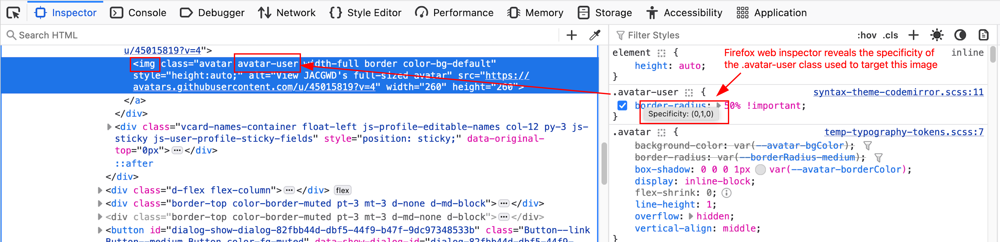

# Introduction

Cascading Style Sheets is the language that defines the appearance of web pages. It is based on targeting a particular part of a web page and then applying specific rules, such as font choice, color, and spacing to the target.

## Selectors

By default, CSS targets HTML elements by tag. This is perfect for setting the global style rules of a site. 

### HTML Tags

You can define styles for any HTML tag: paragraphs, headers (titles and subtitles), lists, divs, sections, etc.

However, as a design becomes more refined, certain HTML tags may need to appear differently. For example, a paragraph may need to be presented as a "pull quote" while another paragraph might need to function as a footnote. To be able to target these different tags, we have several ways to write our CSS selectors.

### CSS Classes

The purpose of a class is to give a name to a particular style, and reuse that name as often as necessary. For example, we could use class names such as "introduction", "footnote" or "pullquote". This helps guarantee that the styles remain consistent across the web site.

A class name must start with a period: .footnote

Think of a group of students. If it existed, you could use the HTML tag \<student> to target everyone of them. However, if you needed to refine your targeting and create subsets of students, you could use classes like: brownhair, blondehair, blackhair, coloredhair or blueeyes, browneyes, greeneyes, etc. 

This way, you can assign a different style for any type of student listed on the page. It all depends on the purpose of the page.

### CSS IDs

In terms of style, an ID functions exactly the same way as a class. It is just a selector.

The difference in between the two is in the HTML, not the CSS. In HTML, an ID serves as the selector of a **unique** part of the web page. There can only be one instance of a particular ID on a page. For example, a page might have the company's logo. It can be targeted directly with #logo.

An ID name must start with a hashtag: #footnote

Using the students example once again, the utility of an ID is a unique way to target one specific student. like a student ID number.

For example: student #1235765

### Complex Selectors

The final way to target items on a page is by describing the path to that particular part, starting from the outermost part of the page and working your way in.

For example:

"body > main > section > paragraph" could be written as 

    body main section p
    
This could be used to differentiate the paragraphs inside a section of the main tag from the paragraphs inside the footer, which would use a complex selector such as "footer p".

To reuse the student example again, you could target a GWD student with a complex selector like this:

John Abbott College > GWD > Fall 2024 > Group 1 > John

    .johnabbottcollege .gwd .fall2024 .group1 .john

### CSS Specificity

Specificity is a computer science concept that gives CSS selectors a mathematical "weight". Tags have one number, classes have another, IDs have yet another. If your CSS selector has combinations of tags, classes and/or IDs these numbers add up. The bigger number "wins" when two rules try to control the appearance of a target.

When two CSS rules conflict, such as "p" and "main p", two things can happen:

1. If the CSS specificity of the two rules are the same, the last rule written in the CSS stylesheet wins. 
2. If the CSS specificity of the two rules are not the same, the more specific rule wins.

#### Links about CSS Specificity

[https://dev.to/eleftheriabatsou/understanding-css-specificity-guide-to-style-rule-importance-4jc5](https://dev.to/eleftheriabatsou/understanding-css-specificity-guide-to-style-rule-importance-4jc5)

[https://www.geeksforgeeks.org/css-specificity/](https://www.geeksforgeeks.org/css-specificity/)

##### YouTube 

[https://www.youtube.com/watch?v=c0kfcP_nD9E](https://www.youtube.com/watch?v=c0kfcP_nD9E)