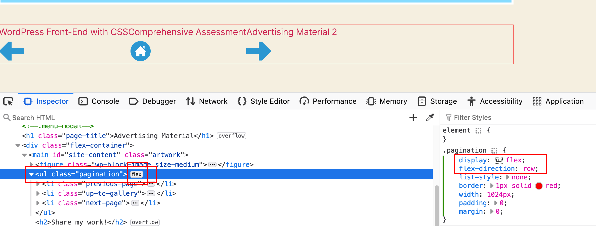

# CSS Flexible Box Layout aka Flexbox

Because web pages are now displayed on a wide variety of screen sizes and shapes, the techniques used to layout the page have evolved from designing for the "most commonly used screen size" (similar in approach to designing for 8.5x11 paper) to "designing a grid that shrinks and expands automatically to fit whatever screen it is displayed on".

In a nutshell, that is **responsive design**.

## Technologies for responsive design

To deal with the issues of designing for multiple kinds of media simultaneously, several technologies were invented:

### Media Queries 

A way for the web browser to question the display device to learn what the display is, and what it is capable of. 

For example: high dpi and high color smartphone display, 1536x1024px, in portrait mode…

### CSS Grid

An algorithm that automatically generates a perfect grid of columns and rows out of the **child elements** of a container element. The container has a display: grid; property. 

CSS Grid works both horizontally and vertically at the same time. 

### CSS Flexbox

An algorithm that automatically generates an "elastic" (flexible, stretchy) box that expands or contracts **in one dimension at a time** to fit whatever device it is displayed upon. 

#### CSS Flexbox Terminology

The following terms are associated with the flexbox layout model.

This section is based in large part on [Wikipedia’s Flexbox page](https://en.m.wikipedia.org/wiki/CSS_Flexible_Box_Layout)

##### Flex container
Parent element that holds all flex items. Using the CSS display property, the container can be defined as either flex or inline-flex.

##### Flex item
Any direct child element held within the flex container is considered a flex item. Any text within the container element is wrapped in an unknown flex item.

##### Axes
Each flex box contains two axes: the main and cross axes. The main axis is the axis on which the items align with each other. The cross axis is perpendicular to the main axis.

##### Flex-direction
Establishes main axis. Possible arguments: row (default), row-reverse, column, column-reverse.

##### Justify-content
Determines how content gets placed on the main axis on the current line. Optional arguments: left, right, center, space-between, space-around.

##### Align-items
Determines the default for how flex items get placed on the cross axis on each line.

##### Align-content
Determines the default for how cross axis lines are aligned.

##### Align-self
Determines how a single item is placed along the cross axis. This overrides any defaults set by align-items.