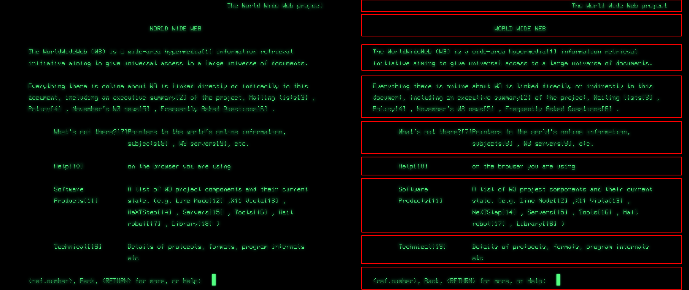
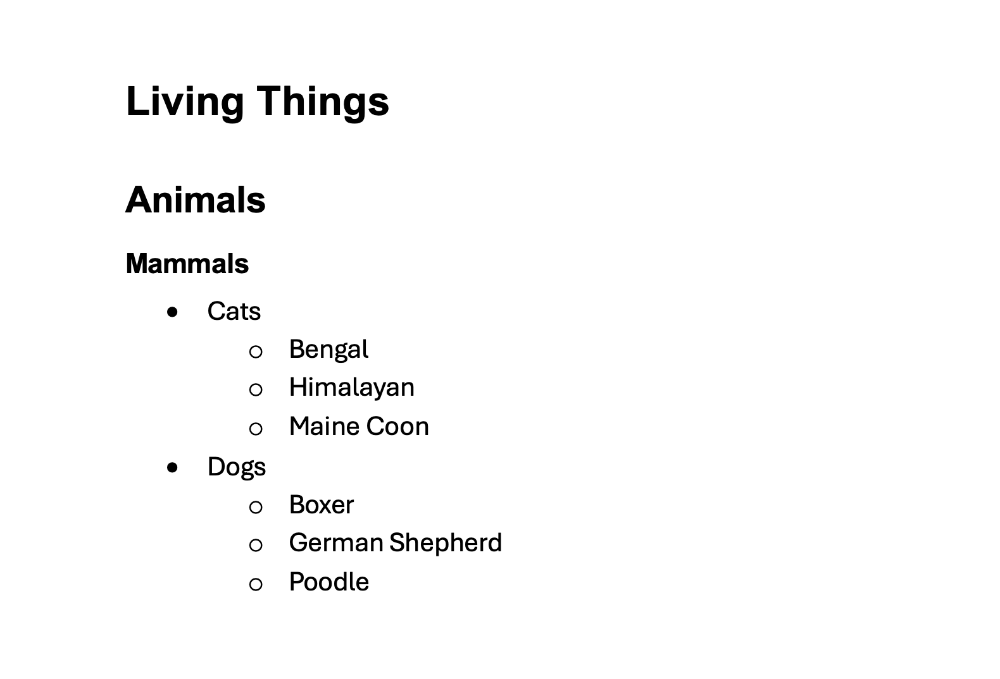
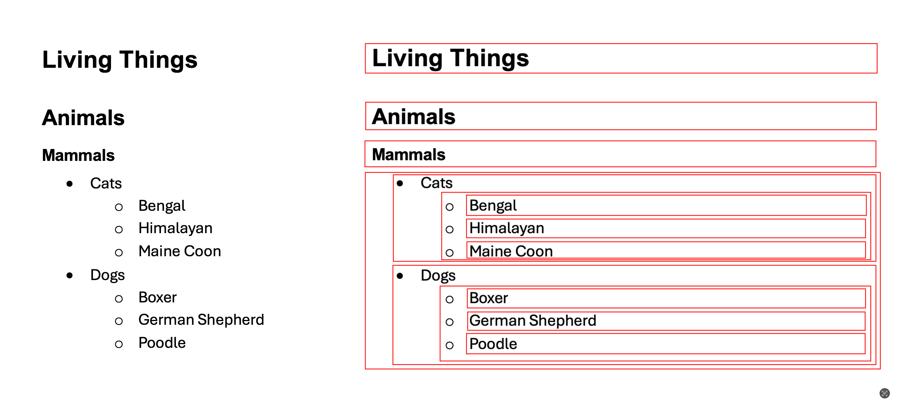
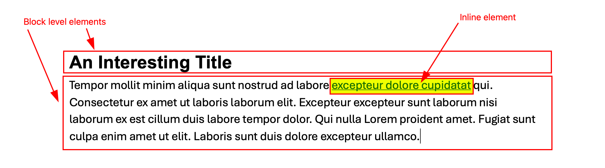

# All about Text Flow

## The Very First Web Page

Note that at the very beginning, there was no graphic design on the World Wide Web. It was just information. However, there was some basic page layout: spaces in between paragraphs or sections for example.

## Text Flow Lesson 1: Source Order

The order of the elements on the page depends on the order in which they were written in the HTML source file.

## Text Flow Lesson 2: Basic Building Blocks

The default behaviour for on-page elements is to **stack one on top of the other**, like titles, subtitles and paragraphs do in a word processor.

Because these elements act like boxes, we refer to them as **block-level elements**.

**Most HTML tags act like block-level elements.**

### Properties of a Block-Level Element

- Block-level elements **always reserve the entire width of a line for themselves**. (Even if they do not have enough content to fill the line. Ex: a single word title still takes up a whole line on the page.)
- In other words, a block-level element always starts on a new line.
- Web browsers automatically add some space (aka margins) before and after a block-level element.
- Block-level elements can be given a height and a width.

### List of Block-Level Elements

- address 
- article 
- aside 
- blockquote 
- canvas 
- dd 
- div 
- dl 
- dt 
- fieldset 
- figcaption 
- figure 
- footer 
- form 
- h1, h2, h3, h4, h5, h6 
- header 
- hr 
- li 
- main 
- nav 
- noscript 
- ol 
- p 
- pre 
- section 
- table 
- tfoot 
- ul 
- video 

## Text Flow Lesson 3: Some Tags are Meant to Stick Together

In HTML, some tags are meant to stick together. For example, an image should stick with the paragraph that it illustrates. Or a hyperlink inside a paragraph should not disrupt the text that surrounds it. These elements need to **share the space**. They are called inline elements (think of: in-line).

### List of HTML tags that are inline:

- a 
- abbr 
- acronym 
- b 
- bdo 
- big 
- br 
- button 
- cite 
- code 
- dfn 
- em 
- i 
- img 
- input 
- kbd 
- label 
- map 
- object 
- output 
- q 
- samp 
- script 
- select 
- small 
- span 
- strong 
- sub 
- sup 
- textarea 
- time 
- tt 
- var 